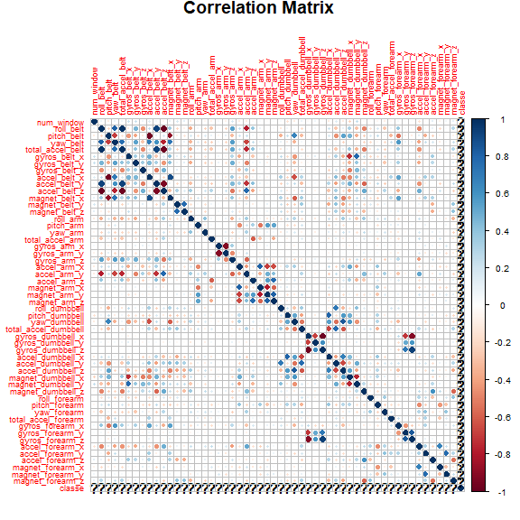
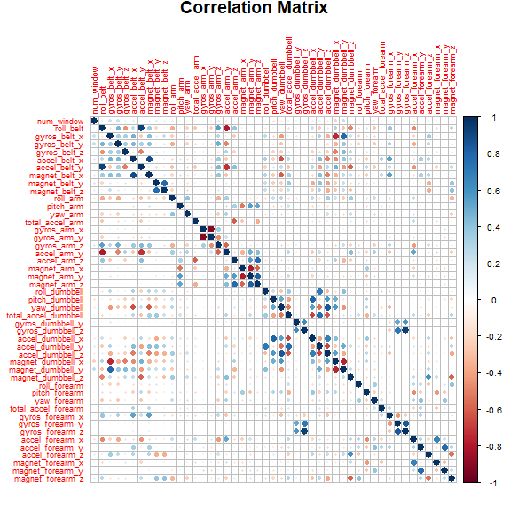

Prediction Assignment for PML
================

### Introduction

Using devices such as Jawbone Up, Nike FuelBand, and Fitbit it is now possible to collect a large amount of data about personal activity relatively inexpensively. These type of devices are part of the quantified self movement – a group of enthusiasts who take measurements about themselves regularly to improve their health, to find patterns in their behavior, or because they are tech geeks. One thing that people regularly do is quantify how much of a particular activity they do, but they rarely quantify how well they do it. In this project, our goal will be to use data from accelerometers on the belt, forearm, arm, and dumbell of 6 participants. They were asked to perform barbell lifts correctly and incorrectly in 5 different ways.

### Data

The training data is the following csv file:

<https://d396qusza40orc.cloudfront.net/predmachlearn/pml-training.csv>

The testing data is the following csv file:

<https://d396qusza40orc.cloudfront.net/predmachlearn/pml-testing.csv>

### Objective of the data:

The goal of our project is to predict the manner in which they did the exercise. This is the "classe" variable in the training set. We will use various variables from the training data for the prediction. We will partition the data into two sets- one for training and the other for cross validation. After building the model we will predict the "classe" variable for the testing data.

### Loading Libraries

``` r
library(data.table)
library(dplyr)
library(tidyr)
library(tidyverse)
library(ggplot2)
library(corrplot)
library(gbm)
library(AppliedPredictiveModeling)
library(caret)
library(car)
library(rpart)
```

### Loading training and testing datasets

``` r
training <- fread("./pml-training.csv")
testing.data <- fread("./pml-testing.csv")
```

### Tidying the data

Alot of the variables have **NA** values and **missing** values. There are other variables which have timestamps, usernames, and serial number. These variables will be dropped.

``` r
training <- training %>% select(-grep("stdd|time|avg_|var_|amplitude|min_|max_|skew|kurt|new_window|user|V1", names(training)))

testing.data <- testing.data %>% select(-grep("stdd|time|avg_|var_|amplitude|min_|max_|skew|kurt|new_window|user|V1|problem", names(testing.data)))

#Dimension of training dataset
dim(training)
```

    ## [1] 19622    54

``` r
#Dimension of testing dataset
dim(testing.data)
```

    ## [1] 20 53

### Correlation Plot

``` r
training.numeric <- sapply(training,as.numeric)

corr.training <- cor(training.numeric)

c1 <- corrplot(corr.training, title="Correlation Matrix", sig.level = 0.01, insig = "blank", tl.cex=.55, cl.cex=.65, mar=c(0,0,.7,0))
```



``` r
c1
```

There is some correlation between the some of the variables, especially for **accel\_belt\_z**, **total\_accel\_belt**, **pitch\_belt**, **gyros\_dumbbell\_x**, **accel\_arm\_x**, and **yaw\_belt**.

### Correlation Plot after dropping highly co-linear variables

``` r
training.2 <- training[,-c("accel_belt_z", "total_accel_belt", "yaw_belt","pitch_belt","gyros_dumbbell_x","accel_arm_x", "classe")]

training.2.numeric <- sapply(training.2,as.numeric)

corr.training.2 <- cor(training.2.numeric)

c2 <- corrplot(corr.training.2, title="Correlation Matrix", sig.level = 0.01, insig = "blank", tl.cex=.55, cl.cex=.65, mar=c(0,0,.7,0))
```



``` r
c2
```

It seems that the extent of the problem high correlation for some variables have been mitigated.

### Splitting the data inti training set and cross validation set

The training set will be split into two parts for training (70% of data) and cross validation (30% of data).

``` r
inTrain = createDataPartition(training$classe, p = 0.70)[[1]]
training.data = training[ inTrain,]
validation.data = training[-inTrain,]

#Dimension of training.data
dim(training.data)
```

    ## [1] 13737    54

``` r
#Dimension of validate.data
dim(testing.data)
```

    ## [1] 20 53

#### Setting seed for reproducible purpose

``` r
set.seed(2019)
```

### Fitting models using, **random forest** and **linear discriminant analysis methods**.

Two models are fit to the training data using random forest and linear discriminant analysis models.

``` r
control <- trainControl(method = "cv",number = 3)
model.rf <- train(classe~., method="rf", trControl=control, data = training.data, ntree=200)
model.lda <- train(classe~., method="lda", trControl=control, data = training.data, ntree=200)
```

### Creating predictions for the 2 mentioned methods with validation data

Predictions by the two models are made

``` r
pred.rf <- predict(model.rf,validation.data)
pred.lda <- predict(model.lda,validation.data)
```

### Creating stack predctions using random forest method for stack of predictions

A combined model is being created with two previous models and the predictions are made by the combined model.

``` r
pred.data.stack <- data.frame(pred.rf, pred.lda,classe= validation.data$classe)


model.stack <- train(classe~., method="rf",  trControl=control, data = pred.data.stack, ntree=200)

pred.stack <- predict(model.stack,validation.data)
```

### Overall Accuracy

``` r
paste0("Overall accuracy of the random forest model is  ", confusionMatrix(table(pred.rf, validation.data$classe))$overall[[1]])
```

    ## [1] "Overall accuracy of the random forest model is  0.997790994052676"

``` r
paste0("Overall accuracy of the linear discriminant analysis model is  ", confusionMatrix(table(pred.lda, validation.data$classe))$overall[[1]])
```

    ## [1] "Overall accuracy of the linear discriminant analysis model is  0.706711979609176"

``` r
paste0("Overall accuracy of the combined model is  ", confusionMatrix(table(pred.stack, validation.data$classe))$overall[[1]])
```

    ## [1] "Overall accuracy of the combined model is  0.997790994052676"

The overall accuracy for the random forest model and combined model are the equal and the accuracy for the linear discriminant analysis model is much lower than the other two models.

### Out of sample error and model selection

``` r
paste0("Out of sample error of the random forest model is  ", 1 - confusionMatrix(table(pred.rf, validation.data$classe))$overall[[1]])
```

    ## [1] "Out of sample error of the random forest model is  0.00220900594732365"

``` r
paste0("Out of sample error of the linear discriminant analysis model is  ", 1 - confusionMatrix(table(pred.lda, validation.data$classe))$overall[[1]])
```

    ## [1] "Out of sample error of the linear discriminant analysis model is  0.293288020390824"

``` r
paste0("Out of sample error of the combined model is  ", 1 - confusionMatrix(table(pred.stack, validation.data$classe))$overall[[1]])
```

    ## [1] "Out of sample error of the combined model is  0.00220900594732365"

The out of sample errors for the random forest model and combined model are the equal and the error for the linear discriminant analysis model is much more than the other two models. Therefore, the random forest model is chosen as there is no need for a more computationally intensive combined model as the error is same for the two models.

### Prediction of 20 different test cases

``` r
pred.rf.final <- predict(model.rf,testing.data)
paste0("Predictions for the test data are ")
```

    ## [1] "Predictions for the test data are "

``` r
pred.rf.final
```

    ##  [1] B A B A A E D B A A B C B A E E A B B B
    ## Levels: A B C D E

``` r
testing.data.2 <- testing.data %>% cbind(pred.rf.final)
```
